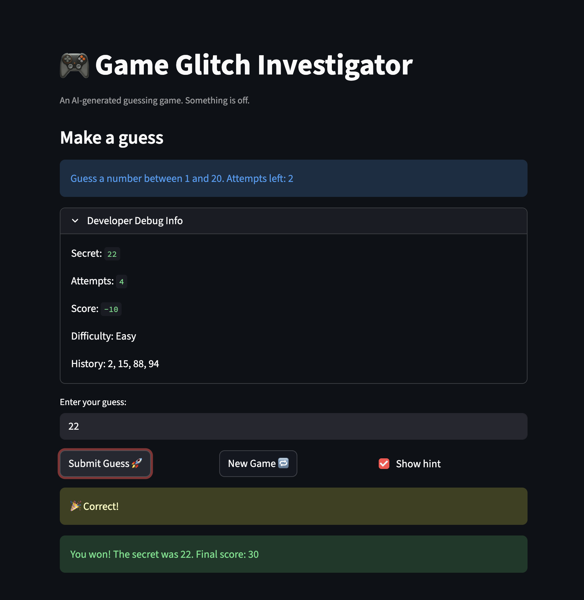

# 🎮 Game Glitch Investigator: The Impossible Guesser

## 🚨 The Situation

You asked an AI to build a simple "Number Guessing Game" using Streamlit.
It wrote the code, ran away, and now the game is unplayable. 

- You can't win.
- The hints lie to you.
- The secret number seems to have commitment issues.

## 🛠️ Setup

1. Install dependencies: `pip install -r requirements.txt`
2. Run the broken app: `python3 -m streamlit run app.py`

## 🕵️‍♂️ Your Mission

1. **Play the game.** Open the "Developer Debug Info" tab in the app to see the secret number. Try to win.
2. **Find the State Bug.** Why does the secret number change every time you click "Submit"? Ask ChatGPT: *"How do I keep a variable from resetting in Streamlit when I click a button?"*
3. **Fix the Logic.** The hints ("Higher/Lower") are wrong. Fix them.
4. **Refactor & Test.** - Move the logic into `logic_utils.py`.
   - Run `pytest` in your terminal.
   - Keep fixing until all tests pass!

## 📝 Document Your Experience

- [ ] The application is a number guessing game where users attempt to guess a randomly generated secret number within a limited number of attempts. The game provides feedback indicating whether guesses are too high or too low and tracks score and history.

- [ ] Secret number occasionally changed due to improper state management. Hint messages were reversed (telling the user to go higher when the guess was already too high). The new game feature ignored difficulty ranges.Some logic functions were mixed with UI code, making the program harder to test.

- [ ]Ensured the secret number persists using st.session_state. Corrected the hint logic. Updated the new game function to respect difficulty ranges. Refactored game logic into logic_utils.py to allow testing with pytest.

## 📸 Demo

- [ ] 
x
## 🚀 Stretch Features

- [ ] [If you choose to complete Challenge 4, insert a screenshot of your Enhanced Game UI here]
